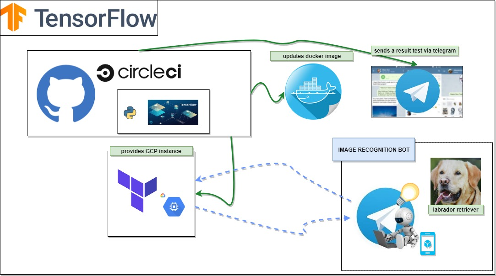

# odroid-tensorflow

Este repositório tem o objetivo de dar suporte ao desenvolvimento de um bot para Telegram usando também o Tensorflow. Links abaixo  

https://github.com/shellscriptx/shellbot/wiki  
https://core.telegram.org/bots  
https://www.tensorflow.org/  

#

## Pipeline current workFlow  
[x] Development into github

